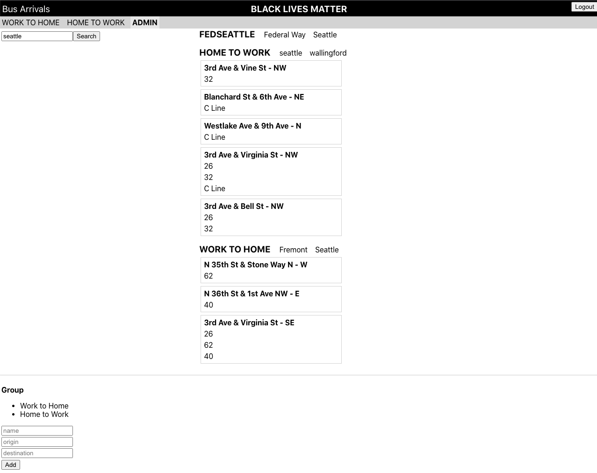

# Bus Dashboard API & React Frontend

Our proposal is to create a Node.js API for the Bus Dashboard React app that Lynne created for JS300. The Github repo for the app is at https://github.com/ilynne/bus-arrival-dashboard. It is currently hosted on https://intense-brushlands-86127.herokuapp.com/.

The current app uses Firebase for authentication and app data. It uses a Rails API for calls to the OneBusAway API because it requires an API key. All the data needed to authenticate and consume real time OneBusAway arrival data would be moved to a MongoDB database.

The bus dashboard displays groups of buses at stops. If you have a few stops close by that give you different options for routes, there is no central location to check them all. The Bus Dashboard fills that need.

## Deployed Application

The application is currently deployed to https://whispering-caverns-88263.herokuapp.com. The `/buses` routes have not yet been integrated into the live app but are working. You can test them using Postman.

## Test this App

### Create an account and login


Use the sign up function to create your account. The database prevents duplicate accounts.

Afterwards, use the login function to log into your account. You will receive a token and see the following landing page:


### Creating a Group of Stops and Buses


Create groups of stops and buses through the admin tab by given your group a name. Then assign a bus and the desired stops. Reload the page to see the new group under the header.

### Viewing a Group of Stops and Buses


Groups will be displayed under the header. Click on a group to display its related stops and buses. OBA will supply the real time data.

### Deleting a Group or Stop


Use the admin page to delete individual stops or whole groups. You can also add additional buses or stops to existing groups.

### Search



Type a search word and click "Search" to get a list of groups that match your query on name, origin, or destination. This can help you choose buses for your routes.

## Test this API (postman)

### Create an account

`POST` to https://whispering-caverns-88263.herokuapp.com/login/signup. Send:
```
{
  "email":<email>,
  "password":<password>
}
```

You will receive a `User` object.

### Get a token

`POST` to https://whispering-caverns-88263.herokuapp.com/login. Send:
```
{
  "email":<email>,
  "password":<password>
}
```

You will receive a token. Use it to set a `Bearer Token` for the following.

### Create a Group

`POST` to https://whispering-caverns-88263.herokuapp.com/groups. Send:
```
{
  "userId":<userId>,
  "name":"My Group Name",
  "origin":"My Origin",
  "destination":"My Destination"
}
```

You will receive a `Group` object. Note the `_id` for the groupId field for creating a Stop.

### Create a Stop

`POST` to https://whispering-caverns-88263.herokuapp.com/stops. Send:
```
{
  "groupId":<groupId>,
  "stopId":"OBA stop reference name",
  "busId":"OBA bus reference name"
}
```

You will receive a `Stop` object. Note the `_id` for the stopId field for creating a Bus.

### Create a Bus

`POST` to https://whispering-caverns-88263.herokuapp.com/buses. Send:
```
{
  "stopId":<stopId>,
  "busId":"OBA bus reference name"
}
```

You will receive a `Bus` object.

## Project Progress

### One Bus Away Routes

- `GET` https://whispering-caverns-88263.herokuapp.com/oba/routes/1. You will get data for all the routes for King County Metro.
- `GET` https://whispering-caverns-88263.herokuapp.com/oba/routes/1_100252/stops. You will get stops for the route id. The sample is the 62.
- `GET` https://whispering-caverns-88263.herokuapp.com/oba/stops/1_420/arrivals. You will get stops for the route id. The sample is SE 3rd and Virginia.

### Authentication:

- [x] `/signup`
- [x] `/login`
- [x] `/logout`
- [ ] `/reset` -- This route will probably be added at a later date. It requires sending an email.

### App CRUD routes:

Groups:

- [x] POST `/groups`
- [x] GET `/groups` -- allows a `query` parameter to search groups by name, origin, and destination. The search returns all groups that match the text search, with stops included.
- [x] GET `/groups/:id`
- [x] PUT `/groups/:id`
- [x] DELETE `/groups/:id`

Stops:

- [x] POST `/stops`
- [x] GET `/stops` -- should allow a groupId query param to list only stops that belong to a single group.
- [x] GET `/stops/:id`
- [x] PUT `/stops/:id`
- [x] DELETE `/stops/:id`

Buses:

- [x] POST `/buses`
- [x] GET `/buses/` -- should allow a stopId query param to list only buses at a single stop and also a groupId query param to list only buses that belong to the group and stop.
- [x] GET `/buses/:id`
- [x] PUT `/buses/:id`
- [x] DELETE `/buses/:id`

### OneBusAway endpoints:

This data must be pulled from the OneBusAway API using an API key. It should not be stored in Mongo, but the MongoDB data above is necessary to use this data. We DO need to store an API environment API key to access these routes.

- [x] GET `/oba/routes`
- [x] GET `/oba/routes/:id/stops`
- [x] GET `/oba/stops/:id/arrivals`

### Migration:

- [ ] ~The current app does not have a default option for the group. It also uses one table for buses at stops. We will need to migrate these. We also need to migrate existing users, who will need to reset their passwords.~ -- this step was deemed unnecessary for phase 1 of this project

### Models

User:

- [x] email
- [x] password
- [x] passwordResetToken

Authentication:

- [x] userId
- [x] token

Group:

- [x] userId
- [x] origin
- [x] destination
- [ ] ~default -- boolean, only one default per user, this should be validated, default is false~ -- this attribute was deemed unnecessary

Stop:

- [x] groupId
- [x] stopId -- OneBusAway id, which should be unique to the group
- [x] busId -- OneBusAway id.

Bus:

- [x] stopId
- [x] busId -- OneBusAway id, must be unique to the stop

## Project Retrospective

Overall, the project managed to deliver on the promises that had been made in the beginning. The dashboard was created and is functional. While some functionality and interfaces remain rough around the edges, this should be easily resolved during a second phase.

The issues we experienced were less concerned with setting up the API or testing that is was working. They were more technical in nature when it came to deploying and integrating the API with a React frontend. Overall, we experienced a lot of issues with branching and continuous integration when deploying to heroku and issues with React and the express router of the API.

Please see the notes below for additional points.

### Continue

- Use OBA to provide real time arrival data
- Level of collaboration and code review
- Troubleshooting and debugging

### Challenges

- Loss of resources
- Questioned a pre-existing database structure
- Continuous deployment and continuous integration setup through heroku and github
- Integrating a React frontend with express router
- How to get the token set in the browser
